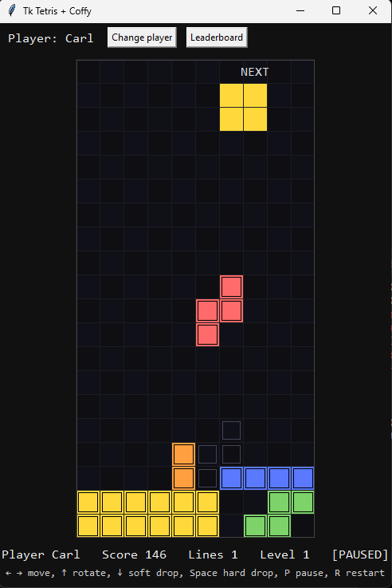
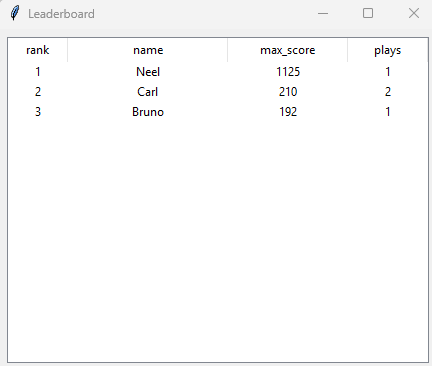

# Tetris Arcade Machine



## Overview

This project is a **Tetris arcade machine software** written in Python using `tkinter` for graphics and [Coffy](https://github.com/nsarathy/coffy) for all data management.  
It is designed to be easily run on small arcade setups, Raspberry Pi builds, or desktop systems.

The game supports:
- Player account creation
- Password-protected logins for existing accounts
- Automatic tracking of game history
- Leaderboard with high score rankings
- Persistent storage of player credentials and scores

---

## How It Works

### Gameplay
Classic Tetris rules apply: arrange falling tetrominoes to clear lines and score points.  
When a player starts:
1. They are prompted for a **name**.
2. If the name exists, they must enter the password to continue.
3. If it’s a new name, they set a password.

### Data Management
Coffy is used as an embedded data engine for persistent storage:

| Data Type               | Coffy Component | Storage Format |
|------------------------|-----------------|----------------|
| Player names/passwords | `coffy.nosql`   | JSON file      |
| Game history           | `coffy.sql`     | SQLite         |

- **NoSQL** holds player credentials and simple settings.
- **SQL ORM** stores game results, scores, and timestamps.
- Leaderboard queries are generated directly from the SQL backend.

---

## Installation

```bash
git clone https://github.com/nsarathy/tetris-arcade-machine.git
cd tetris-arcade-machine
python tetris.py
````

If Coffy is not already installed:

```bash
pip install coffy
python tetris.py
```

---

## Controls

* **Arrow Keys** – Move tetromino left/right/down
* **Up Arrow** – Rotate
* **Space** – Hard drop
* **P** – Pause
* **L** – View leaderboard

---

## Leaderboard



The leaderboard ranks players by their highest score stored in the SQL backend.

---

## Future Enhancements

* Arcade button mappings
* Multi-game statistics
* Graph-based matchmaking and events (possible future Coffy integration)

---

## License

MIT License


